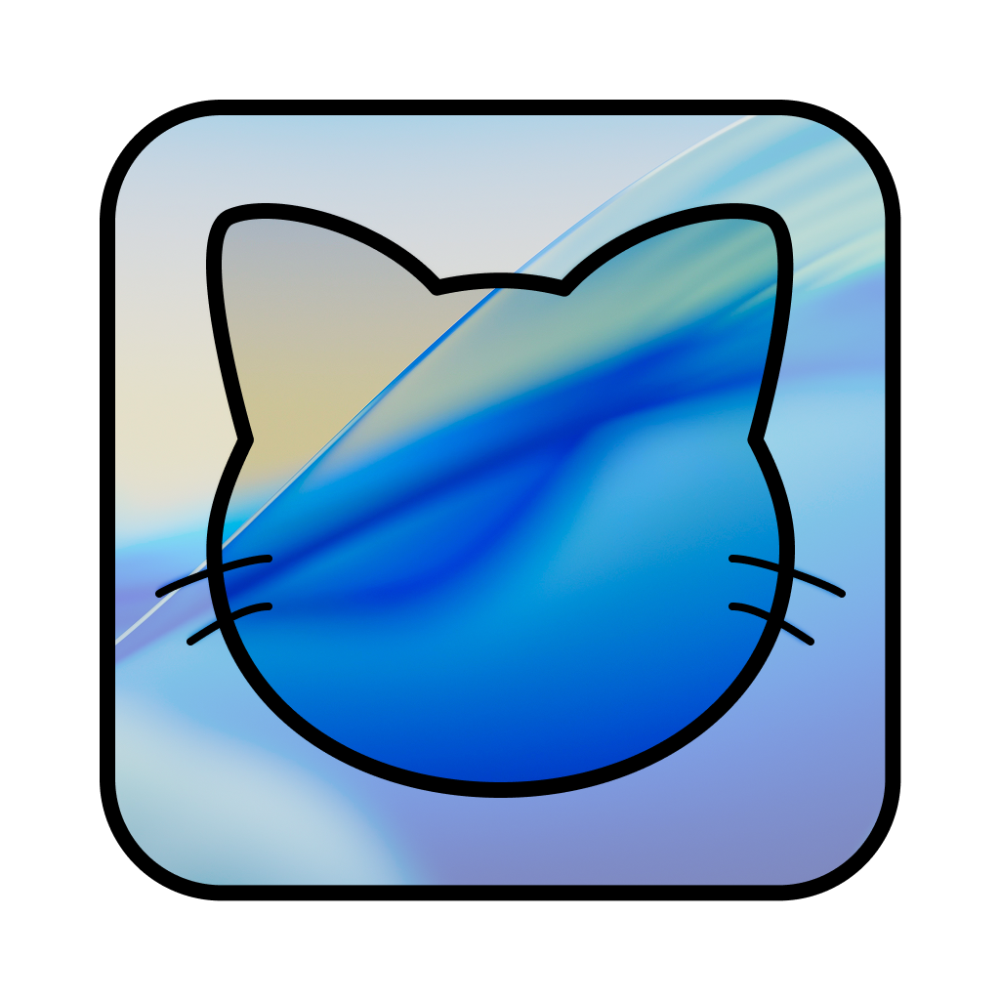
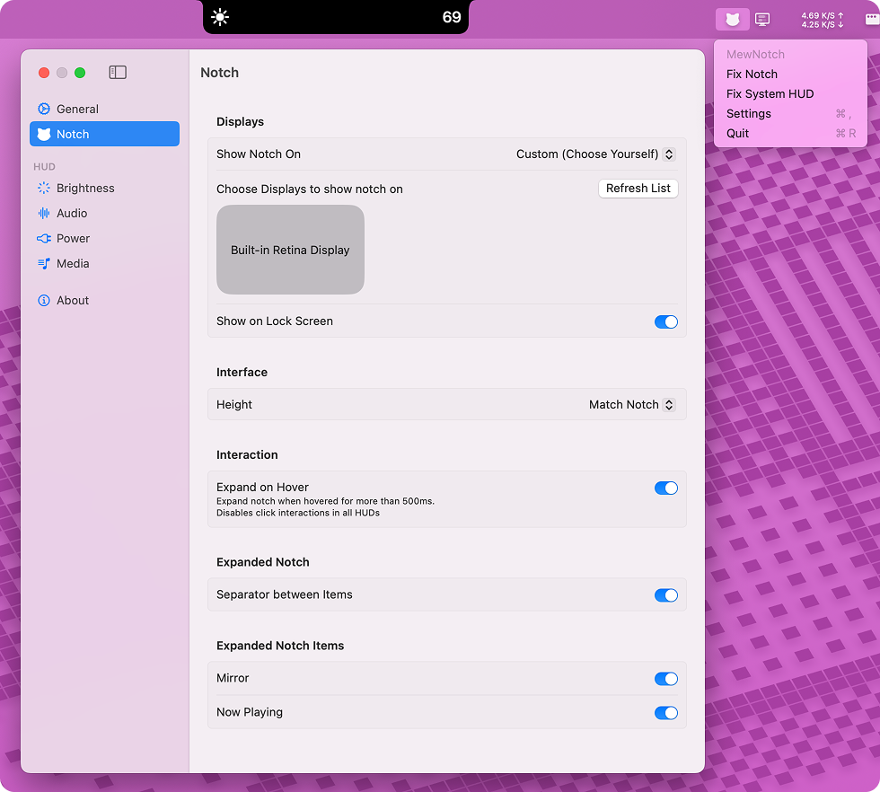

# MewNotch

**Make the Mac Notch Actually Useful!**

*Transform your Mac's notch into a powerful, customizable HUD for system information and controls*

 

---

## ✨ Overview

This is a free, open-source macOS application that transforms the MacBook Pro's notch into a functional, beautiful HUD (Heads-Up Display). Instead of just being a camera housing, your notch becomes an interactive information center displaying system status, media controls, and more.

**Key Benefits:**
- 🎯 **Minimal & Non-Intrusive** - Clean, lightweight alternative to system HUDs
- 🔒 **Privacy-First** - No data collection, runs entirely locally
- 🎨 **Highly Customizable** - Choose what to display and how it looks
- ⚡ **Real-time Updates** - Instant feedback for system changes
- 🖥️ **Multi-Monitor Support** - Works across all your displays

## 🚀 Features

### Core HUD Displays

#### 📱 **Brightness Control**
- Real-time brightness level display with smooth animations
- Supports both manual and auto-brightness changes
- Visual feedback when adjusting brightness via keyboard or Touch Bar

#### 🔊 **Audio Management**
- **Volume Display** - Shows input/output volume changes with elegant animations
- **Device Switching** - Displays current audio input/output device when changed
- **Visual Feedback** - Instant response to volume adjustments

#### 🔋 **Power Status**
- Current power source indicator (AC/Battery)
- Battery level and estimated time remaining
- Power state changes with visual notifications

#### 🎥 **Video Playback**
- **Media Player Integration** - Shows currently playing media app and title
- **Playback Controls** - Displays play/pause status and progress
- **Time Remaining** - Shows remaining time for video content
- **App Detection** - Automatically detects and displays media app information

#### 🔒 **Lock Screen Support**
- HUD remains visible even on macOS lock screen
- Secure system integration for continuous monitoring

### Advanced Features

#### 🎨 **Expanded Notch Mode**
- **Mirror View** - Quick selfie preview using the built-in camera
- **Hover to Expand** - Hover over the notch to reveal additional controls
- **Customizable Items** - Choose which expanded features to enable

#### 📋 **Clipboard Buffer & File Shelf**
- **Multi-Content Support** - Stores images, text, and files from clipboard
- **File Management** - Quick access to recently copied files with drag & drop
- **Drag & Drop** - Drag content directly into the buffer slots or out to use
- **Up to 3 Items** - Keeps recent clipboard history for quick access
- **Auto-Detection** - Automatically captures new clipboard content
- **Quick Access** - Click to open or drag to use content

#### 🖥️ **Multi-Monitor Support**
- **Display Selection** - Choose which monitors show the notch
- **Per-Display Settings** - Customize behavior for each display
- **Automatic Detection** - Automatically adapts to display configuration changes
- **Display Options**:
  - **All Displays** - Show notch on every connected monitor
  - **Notched Displays Only** - Only on MacBook Pro with notch
  - **Custom Selection** - Choose specific displays manually

#### ⚙️ **System Integration**
- **Menu Bar Icon** - Quick access to settings and controls
- **Launch at Login** - Automatic startup with macOS
- **System HUD Replacement** - Option to disable default macOS HUD
- **Touch Bar Support** - Works seamlessly with MacBook Pro Touch Bar

#### 🎯 **Customization Options**
- **HUD Styling** - Modern Island-style design with smooth animations
- **Display Preferences** - Choose which HUDs to show
- **Animation Settings** - Customize transition effects and timing
- **Privacy Controls** - Complete local operation, no data collection
- **Height Modes**:
  - **Match Notch** - Height matches the physical notch
  - **Match Menu Bar** - Height matches the menu bar height
- **Expanded Notch Settings**:
  - **Expand on Hover** - Automatically expand when hovering (disables HUD clicks)
  - **Show Dividers** - Visual separators between expanded items
  - **Customizable Items** - Choose which features to show in expanded mode

## 📦 Installation

### Quick Start

1. **Download** the latest release from the releases page
2. **Extract** the `.dmg` file and drag the app to your Applications folder
3. **Launch** the app from Applications or Spotlight
4. **Grant Permissions** when prompted (camera, accessibility, etc.)

### First Launch Setup

> ⚠️ **Important:** If the app is not signed with an Apple Developer certificate, macOS will show a security warning.

**To bypass the security warning:**
1. Click **"OK"** when the warning appears
2. Open **System Settings** → **Privacy & Security**
3. Scroll down to find the app in the blocked apps section
4. Click **"Open Anyway"** next to the app name
5. Confirm by clicking **"Open"** in the dialog

This only needs to be done once. Future launches will work normally.

### System Requirements

- **macOS 14.0+** (Sonoma or later)
- **MacBook Pro with Notch** (2021 or later)
- **Administrator privileges** (for first-time setup)

### Permissions Required

- **Camera Access** - For mirror functionality
- **Accessibility** - To monitor system events
- **Screen Recording** - For video playback detection

## 🎮 Usage

### Getting Started

1. **Launch the app** from Applications or Spotlight
2. **First Launch**: The app may need to restart once to properly initialize
3. **Grant Permissions** when prompted for camera, accessibility, and screen recording
4. **Customize Settings** by clicking the menu bar icon or using Cmd+Comma

### Basic Operation

#### **System Controls**
- **Brightness**: Use F1/F2 keys or Touch Bar - see real-time feedback in the notch
- **Volume**: Use F10/F11/F12 keys or Touch Bar - watch volume levels appear
- **Audio Devices**: Switch devices in System Settings - device changes are shown instantly

#### **Video Playback**
- **Start Playing**: Any video in Safari, YouTube, Netflix, etc. will show playback info
- **Media Controls**: See app name, play/pause status, and time remaining
- **Automatic Detection**: Works with most media players and browsers

#### **Power Management**
- **Battery Status**: Automatically shows when on battery power
- **Time Remaining**: Displays estimated battery life
- **Charging Status**: Visual indicator when plugged in

### Customization

#### **Display Settings**
- **Monitor Selection**: Choose which displays show the notch
- **HUD Selection**: Enable/disable specific HUD types
- **Lock Screen**: Toggle notch visibility on lock screen

#### **Expanded Notch**
- **Hover to Expand**: Hover over the notch to reveal additional features
- **Mirror**: Quick camera preview for video calls
- **Clipboard Buffer**: 
  - **Auto-Capture**: Automatically saves clipboard content (images, text, files)
  - **Drag & Drop**: Drag content into buffer slots or drag out to use
  - **Quick Access**: Click items to open them in their default apps
  - **History**: Keeps up to 3 recent clipboard items

#### **Menu Bar Access**
- **Settings**: Click the menu bar icon for quick access
- **Toggle Features**: Enable/disable HUDs on the fly
- **System Integration**: Option to disable default macOS HUD

### Troubleshooting

If the notch doesn't appear:
1. **Check Permissions** in System Settings → Privacy & Security
2. **Restart the App** - sometimes needed after permission changes
3. **Verify Display** - ensure you're using a MacBook Pro with notch
4. **Check Settings** - make sure the notch is enabled for your display

## 🗺️ Roadmap

### ✅ Completed Features
- [x] **Core HUD System** - Brightness, Audio, Power, Video displays
- [x] **Expanded Notch Mode** - Mirror view and hover interactions
- [x] **Clipboard Buffer & File Shelf** - Multi-content support with drag & drop, including files
- [x] **Multi-Monitor Support** - Display selection and customization
- [x] **System Integration** - Menu bar, launch at login, Touch Bar
- [x] **Lock Screen Support** - HUD visibility on macOS lock screen
- [x] **Customization Options** - Height modes, display preferences
- [x] **Settings Interface** - Comprehensive configuration options

### 🚧 Planned Features
- [ ] **Keyboard Backlight HUD** - Display keyboard brightness changes
- [ ] **Enhanced Video Controls** - Play/pause, skip, volume controls
- [ ] **Notification Integration** - Display system notifications
- [ ] **Time & Date Widget** - Quick time/date display

### 💡 Future Possibilities
- [ ] **Weather Widget** - Current weather and forecasts
- [ ] **Calendar Integration** - Upcoming events and reminders
- [ ] **System Monitoring** - CPU, memory, network stats
- [ ] **Custom Themes** - Additional visual styles and colors
- [ ] **Plugin Architecture** - Third-party HUD extensions
- [ ] **Shortcuts Integration** - macOS Shortcuts app support
- [ ] **Accessibility Improvements** - VoiceOver and other accessibility features
- [ ] **Performance Optimizations** - Reduced battery usage and improved responsiveness

## 🛠️ Technical Details

### Architecture
- **Built with SwiftUI** - Modern, declarative UI framework
- **Swift + Objective-C** - Hybrid approach for system integration
- **Real-time Monitoring** - Efficient system event listeners
- **Multi-threaded** - Background processing for smooth performance

### Dependencies
- **[Lottie](https://github.com/airbnb/lottie-ios)** - Smooth animations and micro-interactions
- **[LaunchAtLogin-Modern](https://github.com/sindresorhus/LaunchAtLogin-Modern)** - Automatic startup management

### System Integration
- **Core Audio** - Audio device and volume monitoring
- **Core Display** - Brightness level detection
- **Power Management** - Battery status and power source monitoring
- **Screen Capture** - Video playback detection
- **Accessibility** - System event monitoring

## 🤝 Contributing

We welcome contributions! Here's how you can help:

### Ways to Contribute
- 🐛 **Report Bugs** - Found an issue? Open a detailed bug report
- 💡 **Suggest Features** - Have ideas? Share them in discussions
- 🔧 **Code Contributions** - Submit pull requests for improvements
- 📖 **Documentation** - Help improve docs and guides
- 🎨 **Design** - UI/UX improvements and new themes

### Development Setup
1. **Clone** the repository locally
2. **Open** in Xcode 15+ (macOS 14.0+ required)
3. **Build** and run the project
4. **Create** a feature branch
5. **Submit** a pull request

See the contributing guidelines for detailed information.

## 📄 License

This project is licensed under the [GPLv3 License](LICENSE) - see the LICENSE file for details.

## 🙏 Acknowledgments

### Inspiration
- **The Mac Notch** - Making the most of Apple's design choice
- **System HUDs** - Improving upon macOS default behavior
- **User Experience** - Creating something both functional and beautiful

### Technology
- **Built with ♥️** using Swift and SwiftUI
- **System Integration** with Objective-C for low-level access
- **Modern macOS** - Leveraging the latest Apple frameworks

### Open Source Credits
Special thanks to these amazing projects that inspired this work:
- [SlimHUD](https://github.com/AlexPerathoner/SlimHUD) - Volume and brightness HUD inspiration
- [SkyLightWindow](https://github.com/Lakr233/SkyLightWindow) - Window management techniques
- [EnergyBar](https://github.com/billziss-gh/EnergyBar) - Power management integration
- [boring.notch](https://github.com/TheBoredTeam/boring.notch) - Notch utility concepts

---

**Made with ❤️ for the Mac community**

